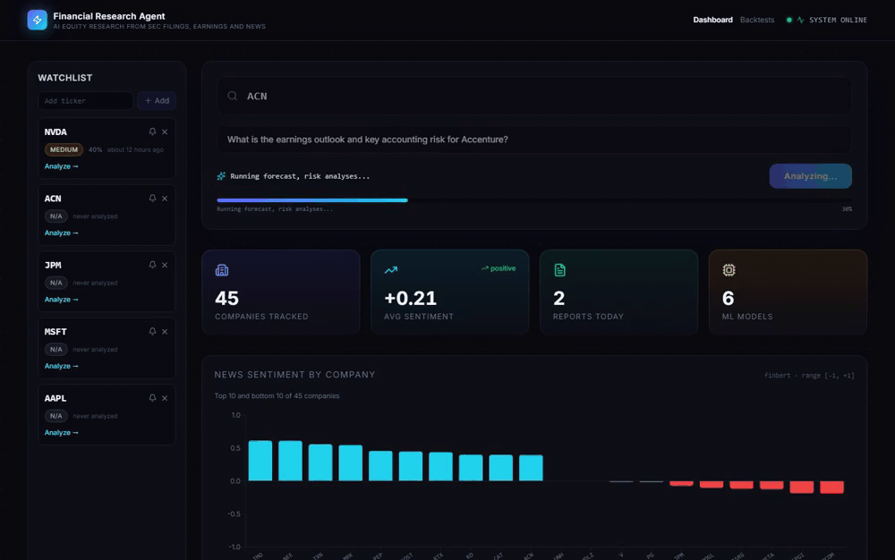
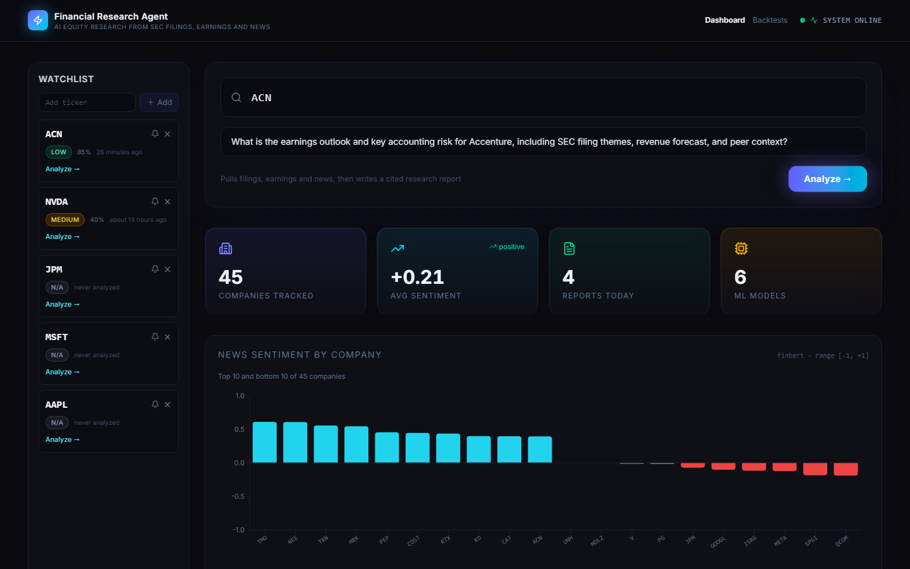
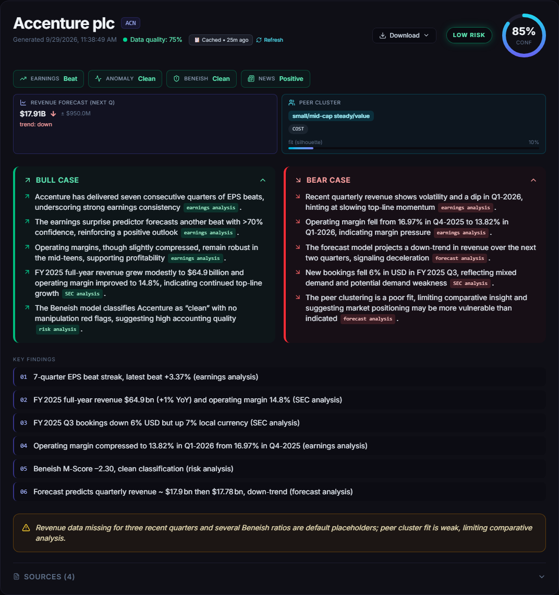

# Financial Research Agent



An LLM-orchestrated equity-research platform. Ask a natural-language question
about a public company and it routes the question to the right mix of
specialist analyses — SEC-filing semantic search, earnings-surprise
prediction, news sentiment, accounting-risk models, and revenue forecasting —
then synthesizes a structured, source-cited research report (bull case, bear
case, risk level, confidence).

Built as a portfolio project to demonstrate a production-shaped system:
multi-source ingestion, a vector RAG pipeline, six ML models with
explainability, an async task queue, scheduled re-analysis, alerting,
backtesting, and a React dashboard — all containerized.

> ⚠️ For research and educational use only. Nothing here is financial advice.

[Full demo video (MP4)](docs/media/demo.mp4)

## Screenshots

| | |
|:--|:--|
|  | **Dashboard** — run an analysis and review the synthesized report alongside metrics and news sentiment. |
|  | **Report** — bull/bear cases, risk, confidence, and source-linked findings. |

---

## Architecture

```
                    ┌─────────────┐
   question +       │  Supervisor │   one Groq call (GROQ_MODEL) in JSON mode
   ticker  ───────► │  (router)   │   picks the minimal set of analyses
                    └──────┬──────┘
                           │  ["earnings", "sec", "news", "risk", "forecast"]
                           ▼
                    ┌─────────────┐   loads data per analysis type from Postgres
                    │  Analyzer   │   (+ pgvector RAG for "sec"), prompts the LLM
                    └──────┬──────┘   once per selected analysis
                           │  specialist analyses
                           ▼
                    ┌─────────────┐   merges analyses into a single JSON report,
                    │ Synthesizer │   persists report + citations, fires alerts
                    └──────┬──────┘
                           ▼
              reports + report_citations  ──►  FastAPI  ──►  React dashboard
```

The agent layer is **one LLM used as several personas**, not many agent
instances: the supervisor produces a route, the analyzer runs each selected
persona against the relevant data, and the synthesizer combines the outputs.
Long-running analysis is dispatched to **Celery** so the API stays responsive,
and a **Celery beat** schedule re-analyzes the watchlist nightly and re-ingests
data weekly.

### Data & ML

| Component | What it does | Tech |
|---|---|---|
| Ingestion | SEC EDGAR filings, yfinance earnings, NewsAPI articles | `requests`, `yfinance`, `beautifulsoup4` |
| RAG | 10-K/10-Q chunked, embedded, semantic search | `pgvector`, `bge-large-en-v1.5` |
| Earnings surprise | Predicts next-quarter EPS beat (no temporal leakage) | XGBoost + SHAP |
| News sentiment | Per-article + aggregate sentiment | FinBERT |
| Accounting risk | Beneish M-Score + Isolation-Forest anomaly detector | scikit-learn |
| Revenue forecast | Next-quarter revenue + trend/seasonality | Prophet |
| Peer clustering | Competitive-set grouping | KMeans |
| Experiment tracking | Params, metrics, SHAP plots, model artifacts | MLflow |
| RAG evaluation | Faithfulness / relevancy / context precision | Ragas |

Every ML prediction is persisted to `ml_predictions` with its SHAP values and
input features, so the report layer can explain *why* — and surfaces
cold-start / insufficient-data sentinels instead of silently skipping a
company.

---

## Tech stack

**Backend** Python 3.13 · FastAPI · SQLAlchemy 2 · PostgreSQL + pgvector ·
Redis · Celery · Groq (model via `GROQ_MODEL`) · XGBoost · Prophet · scikit-learn ·
SHAP · sentence-transformers · MLflow · Ragas · WeasyPrint (PDF export)

**Frontend** React 19 · TypeScript · Vite · Tailwind · Recharts · Framer Motion

**Infra** Docker / docker-compose · Gunicorn + Uvicorn workers · Alembic
migrations

---

## Getting started

### Prerequisites
- [uv](https://docs.astral.sh/uv/) (Python package manager)
- Docker (for Postgres + Redis), or local Postgres 16 with the `pgvector`
  extension and a Redis server
- API keys: [Groq](https://console.groq.com), [NewsAPI](https://newsapi.org)
  (SEC filing embeddings use local `BAAI/bge-large-en-v1.5` — no Voyage key)

### 1. Configure environment
```bash
cp .env.example .env   # then fill in your keys and DB/Redis settings
```

### 2. Start infrastructure
```bash
docker compose up -d postgres redis
```

### 3. Install dependencies & run migrations
```bash
uv sync
uv run alembic upgrade head
```

### 4. Run the stack
```bash
# API
uv run uvicorn backend.api.main:app --reload --port 8000

# Celery worker (separate terminal) — required for /analyze to process
uv run celery -A backend.tasks.celery_app worker --loglevel=info --pool=threads

# Frontend (separate terminal)
cd frontend && npm install && npm run dev
```

API docs: http://localhost:8000/docs · Frontend: http://localhost:5173

### Train the ML models
Models read from Postgres and write predictions back to `ml_predictions`.
Run a module from the project root, e.g.:
```bash
uv run --module backend.ml.earnings_predictor
```

---

## Testing

```bash
uv run pytest
```

The suite covers the deterministic core: earnings feature engineering
(no-leakage contract, cold-start/partial-data sentinels, time-based split),
the Beneish M-Score math and thresholds, ingestion utilities, and LLM-output
sanitization.

---

## Key API endpoints

| Method | Path | Purpose |
|---|---|---|
| `POST` | `/analyze` | Kick off analysis for a ticker + question (async) |
| `GET` | `/analyze/{task_id}` | Poll task status / result |
| `GET` | `/reports/{ticker}` | Report history for a ticker |
| `GET` | `/reports/{report_id}/pdf` | Export a report as PDF |
| `GET` | `/companies` · `/stats` · `/sentiments` | Dashboard data |
| `*` | `/watchlist`, `/alerts/*`, `/backtest/*` | Watchlist, alerting, backtesting |
| `GET` | `/health` · `/schedule/status` | Ops / observability |

---

## Known limitations

Deliberately scoped as a portfolio project, not a trading system. The honest
caveats:

- **Backtesting is illustrative, not statistically significant.** Reports
  cluster around when ingestion ran (not uniform intervals), per-ticker sample
  sizes are small, the bull/bear "signal" is a coarse heuristic, forward
  windows are calendar (not trading) days, and returns are gross — no costs,
  slippage, or lookahead-bias guard. See the methodology note in
  [`backtesting/engine.py`](backend/backtesting/engine.py).
- **Not investment advice.** Outputs are LLM-synthesized and can be wrong; the
  report layer surfaces a confidence score and data-quality signal precisely
  because individual claims should be verified against the cited sources.
- **Single-tenant.** No auth/multi-user yet — the watchlist and alert
  subscriptions are effectively one global list.
- **Report cache invalidation is manual.** `AGENT_VERSION` in
  [`core/cache.py`](backend/core/cache.py) must be bumped when prompts or agent
  logic change, or cached reports for an unchanged (ticker, question) are
  reused within the TTL.
- **Rate limiter fails open.** If Redis is unreachable the limiter logs and
  allows the call rather than blocking the pipeline — favouring availability
  over strict quota enforcement.
- **Cold-start tickers.** Companies with too little history get an explicit
  `insufficient_data` sentinel (earnings needs ≥4 quarters, revenue ≥4) rather
  than a fabricated prediction; run more ingestion to graduate them.

---

## Project layout

```
backend/
  agents/        supervisor · analyzer · synthesizer · prompts
  ml/            earnings, anomaly, beneish, sentiment, peer clustering, forecaster
  rag/           chunking, embedding, retrieval, QA
  ingestion/     EDGAR / yfinance / NewsAPI clients + pipeline
  backtesting/   historical report replay + performance analysis
  api/           FastAPI app, routes, schemas
  tasks/         Celery app, analysis / scheduled / backtest tasks
  core/          caching, alerts, rate limiting, logging, PDF export
  db/            SQLAlchemy models, CRUD, Alembic migrations
frontend/        React + Vite dashboard
tests/           pytest suite
```
